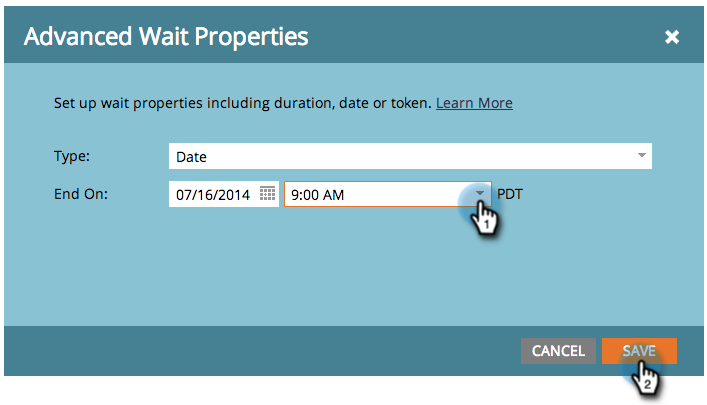

# Usar una fecha específica en un paso de flujo de espera {#use-a-specific-date-in-a-wait-flow-step}

Puede utilizar el paso de flujo &quot;[!UICONTROL Wait]&quot; para pausar el recorrido de una persona a través de una campaña inteligente hasta una fecha determinada.

1. En la pestaña **[!UICONTROL Flujo]** de tu campaña inteligente, arrastra el cursor sobre el paso de flujo **[!UICONTROL Esperar]**.

   

1. Haga clic en el icono de engranaje.

   

1. En el menú desplegable **[!UICONTROL Tipo]**, seleccione **[!UICONTROL Fecha]**.

   

1. Seleccione la fecha específica en la que desea reanudar.

   

1. Especifique la hora (opcional) y haga clic en **[!UICONTROL Guardar]**.

   

>[!MORELIKETHIS]
>
>* [Usar una duración en un paso de flujo de espera](/help/marketo/product-docs/core-marketo-concepts/smart-campaigns/flow-actions/wait/use-a-duration-in-a-wait-flow-step.md){target="_blank"}
>* [Usar un token de fecha en un paso de flujo de espera](/help/marketo/product-docs/core-marketo-concepts/smart-campaigns/flow-actions/wait/use-a-date-token-in-a-wait-flow-step.md){target="_blank"}
