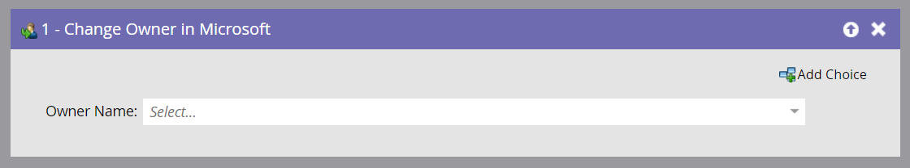

# Cambiar propietario en Microsoft {#change-owner-in-microsoft}

Si tiene personas existentes que ya están asignadas a un propietario, puede utilizar este paso de flujo para reasignarlas a otro propietario.

>[!NOTE]
>
>Este paso de flujo _solo funcionará cuando se utilice con déclencheur_, no con filtros, en su campaña inteligente.

**Uso**

1. Simplemente elija el propietario que desea cambiar a y vaya!

   

   >[!NOTE]
   >
   >Si el registro aún no existe en su cuenta de Dynamics, lo sincronizaremos y lo asignaremos al usuario seleccionado.
