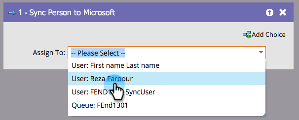

# Sincronizar persona con Microsoft {#sync-person-to-microsoft}

Esta característica es sólo para aquellos que integran Marketo Engage con [!DNL Microsoft Dynamics].

## Información general {#overview}

Este paso de flujo insertará personas creadas por Marketo en su CRM [!DNL Dynamics].

## Uso {#usage}

Puede establecer un usuario [!DNL Dynamics] como propietario de la persona.

>[!NOTE]
>
>Al usar la acción de flujo &quot;[!UICONTROL Sincronizar persona con Microsoft]&quot; (solo en una campaña de Déclencheur), el posible cliente/contacto se creará en tiempo real en Dynamics.
