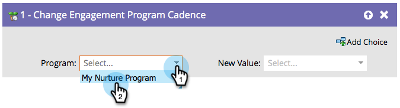

# Cambiar cadencia del programa de participación {#change-engagement-program-cadence}

Una vez que una persona está siendo nutrida por un programa de participación, puede pausar temporalmente la nutrición para ella mediante este paso de flujo.

>[!NOTE]
>
>Si una persona no es miembro del programa y ejecuta este paso de flujo, se agregará automáticamente como miembro y se agregará al primer flujo.

1. Seleccione el programa de participación.

   

1. Seleccione **[!UICONTROL En pausa]** como **[!UICONTROL Nuevo valor]** para evitar que la persona reciba contenido.

   

Puede volver a establecer a la persona en **[!UICONTROL Normal]** si desea que vuelva a recibir contenido.
