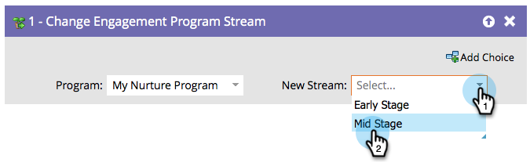

# Cambiar secuencia de programa de participación {#change-engagement-program-stream}

Normalmente, utilizaría [reglas de transición de flujo](/help/marketo/product-docs/email-marketing/drip-nurturing/engagement-program-streams/transition-people-between-engagement-streams.md) para conseguirlo. Pero si desea mover manualmente a las personas de un flujo a otro, este es el paso de flujo que debe utilizar.

1. Seleccione el programa de participación al que desee mover a la persona.

   >[!NOTE]
   >
   >Si selecciona un programa diferente, dejará a la persona en su flujo actual, así como la agregará al nuevo.

   

1. Seleccione el flujo al que desee agregar a sus recursos.

   
