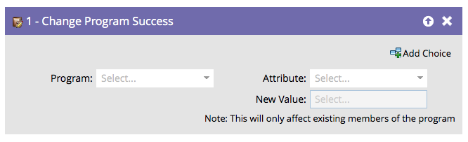

# Cambiar el éxito del programa {#change-program-success}

Si alguna vez tiene un grupo de personas marcado incorrectamente con Éxito del programa, puede utilizar este paso de flujo para establecer el éxito en verdadero o falso.

1. Al arrastrar este paso de flujo, el programa se establecerá automáticamente en el programa que contiene la campaña inteligente que está editando.

   >[!NOTE]
   >
   >Solo se verán afectados los miembros del programa.

   

1. Seleccione **[!UICONTROL Éxito]** o **[!UICONTROL Fecha de éxito]** como atributo.

   

   >[!NOTE]
   >
   >Si establece [!UICONTROL Fecha de éxito] en cualquier valor, el éxito se establece automáticamente en verdadero. Si se establece [!UICONTROL Success] en true, la fecha de éxito se establece automáticamente en la fecha actual.

1. Establezca **[!UICONTROL Nuevo valor]** en **[!UICONTROL Verdadero]** o **[!UICONTROL Falso]**.

   

   >[!TIP]
   >
   >Puede utilizar el paso de flujo dos veces para establecer tanto el indicador de éxito como la fecha.

¡Excelente! Ahora sabe cómo deshacer y forzar el éxito.
