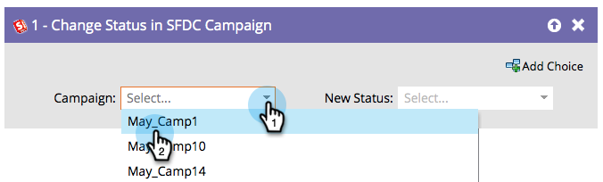

# Cambiar estado de la campaña SFDC {#change-status-in-sfdc-campaign}

Este paso de flujo le permite cambiar el estado de miembro de la campaña de Salesforce de los posibles clientes.

>[!NOTE]
>
>Solo está disponible cuando se integra con [!DNL Salesforce].

Si un posible cliente no existe en Salesforce o aún no es miembro de la campaña, se sincroniza automáticamente y se agrega a la campaña de Salesforce con el estado adecuado.

1. Primero busque y seleccione la Salesforce **[!UICONTROL Campaign]** en la que se encuentra el registro.

   

1. A continuación, seleccione el **[!UICONTROL nuevo estado]** que desee establecer y habrá terminado.

   
