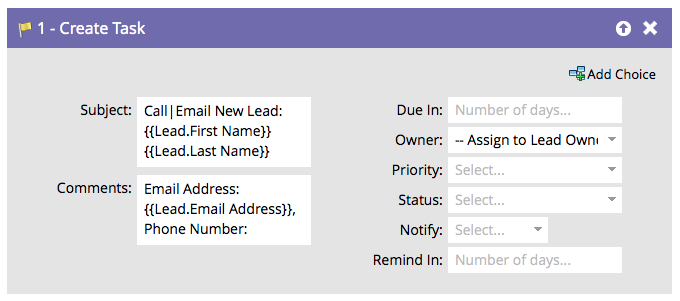

# Crear tarea {#create-task}

Como experto en marketing, dispone de información que puede ayudar a las ventas a cerrar acuerdos. Puede crear tareas para que sepan lo que deben hacer y cuándo deben hacerlo.

>[!NOTE]
>
>Cuando el usuario de sincronización de Marketo está creando tareas, **[!UICONTROL Vence en]** es un campo obligatorio para que la tarea se cree en Salesforce. Marketo introducirá cinco días de forma predeterminada si no hay ningún valor.

De forma predeterminada, el paso de flujo tendrá este aspecto:

Personalice todos los campos para crear la tarea de la manera que desee.

>[!TIP]
>
>Puede usar `{{lead.tokens}}`, `{{company.tokens}}`, `{{campaign.tokens}}` y `{{system.tokens}}` en el **[!UICONTROL Asunto]** y **[!UICONTROL Descripción]**. Consulte [Tokens para pasos de flujo](/help/marketo/product-docs/core-marketo-concepts/smart-campaigns/flow-actions/use-tokens-in-flow-steps.md){target="_blank"} para obtener más información.
