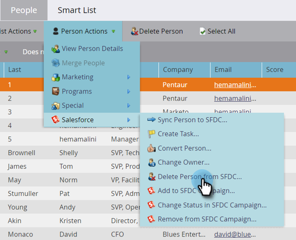

# Eliminar persona de SFDC {#delete-person-from-sfdc}

Si necesita eliminar un conjunto específico de posibles clientes de Salesforce pero dejarlos como personas en Marketo Engage, puede utilizar la acción de flujo Eliminar persona de SFDC.

>[!NOTE]
>
>Solo está disponible cuando se integra con [!DNL Salesforce].

1. En la base de datos, haga clic en la persona que desee eliminar de Salesforce. Luego haga clic en **[!UICONTROL Acciones de persona]** y seleccione **[!DNL Salesforce]**.

   

1. Seleccionar **[!UICONTROL Eliminar persona de SFDC]**.

   

1. Asegúrese de que la opción **[!UICONTROL Eliminar en Marketo]** sea **[!UICONTROL false]** y, a continuación, haga clic en **[!UICONTROL Ejecutar ahora]**.

   

   Una vez que se ejecute el paso de flujo, su persona ya no será un posible cliente en [!DNL Salesforce], pero permanecerá en Marketo.

   >[!CAUTION]
   >
   >Si establece **[!UICONTROL Delete en Marketo]** en **[!UICONTROL true]** y elimina a las personas de Marketo y a los posibles clientes de Salesforce, se irán para siempre. Esto no se puede deshacer.
