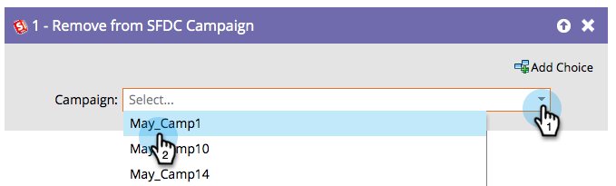

# Quitar de Campaña de SFDC {#remove-from-sfdc-campaign}

Al igual que [Agregar a la campaña de SFDC](/help/marketo/product-docs/core-marketo-concepts/smart-campaigns/salesforce-flow-actions/add-to-sfdc-campaign.md){target="_blank"} y [Cambiar estado en la campaña de SFDC](/help/marketo/product-docs/core-marketo-concepts/smart-campaigns/salesforce-flow-actions/change-status-in-sfdc-campaign.md){target="_blank"}, también puede eliminar personas o posibles clientes de una campaña de Salesforce.

>[!NOTE]
>
>Solo está disponible cuando se integra con Salesforce.

1. Una vez arrastrado en el paso de flujo, busque y seleccione la campaña de Salesforce de la que desee eliminar la persona o el posible cliente.

   

   >[!TIP]
   >
   >Si la persona o posible cliente no es miembro de la campaña seleccionada, se omitirá.

¡Eso es todo! Cuando las personas o los posibles clientes pasen por ahí, se eliminarán de la campaña de Salesforce que haya elegido.
