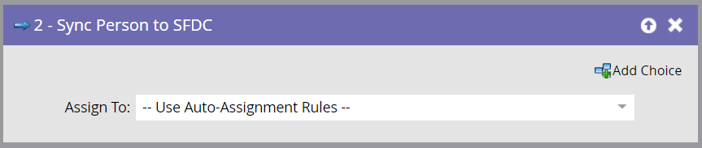

# Sincronizar persona con SFDC {#sync-person-to-sfdc}

Este paso de flujo insertará personas creadas por Marketo como posibles clientes en su Salesforce CRM.

>[!NOTE]
>
>Solo está disponible cuando se integra con [!DNL Salesforce].

1. De forma predeterminada, este paso de flujo asignará a los propietarios de posibles clientes en función de las reglas de asignación automática de Salesforce.

   

   >[!TIP]
   >
   >[!DNL Salesforce] requiere que la persona tenga rellenados los campos Empresa y Apellidos. De lo contrario, rechazará el registro de posibles clientes.

1. Puede establecer un usuario o cola de posibles clientes [!DNL Salesforce] específico como propietario del posible cliente.

   

   Al utilizar este paso de flujo, la persona se sincroniza inmediatamente como posible cliente de [!DNL Salesforce] y no necesita esperar a la sincronización normal.

   >[!CAUTION]
   >
   >[!DNL Salesforce] no permite que &quot;Contactos&quot; se asigne a colas de posibles clientes. En este caso, Marketo creará un &quot;posible cliente&quot; duplicado en [!DNL Salesforce].
