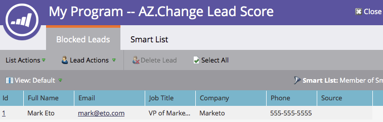

# Ver personas bloqueadas en una campaña inteligente {#view-blocked-people-in-a-smart-campaign}

Las personas bloqueadas en la base de datos de Marketo están marcadas como incluidas en la lista de bloqueados, no suscritas, si el marketing está suspendido y/o tienen un correo electrónico no válido o vacío.

>[!NOTE]
>
>Marketo está cambiando términos como Lista negra y Lista blanca a Lista de bloqueados y Lista de permitidos en nuestro producto. Durante esta actualización, es posible que vea los términos antiguos en nuestra interfaz de usuario y en las capturas de pantalla de la documentación, así como los términos nuevos en nuestro texto de documentación. Pedimos disculpas por cualquier confusión.

1. En la campaña inteligente, haga clic en **Schedule**. En **Estado de lista inteligente** haga clic en el segundo vínculo.

   

   >[!NOTE]
   >
   >Las personas que han alcanzado sus límites de comunicación también pueden ser bloqueadas de recibir correos. Obtenga información sobre cómo [editar límites de comunicación](/help/marketo/product-docs/administration/email-setup/enable-communication-limits.md) en la sección Administración.

   La ficha Personas bloqueadas muestra las personas que pueden no recibir correos electrónicos.

   

   >[!NOTE]
   >
   >Los correos electrónicos operativos se enviarán a las personas marcadas como no suscritas y el marketing suspendido.

   >[!MORELIKETHIS]
   >
   >* [Editar reglas de calificación](/help/marketo/product-docs/core-marketo-concepts/smart-campaigns/using-smart-campaigns/edit-qualification-rules-in-a-smart-campaign.md)
   >* [Habilitar límites de comunicación](/help/marketo/product-docs/administration/email-setup/enable-communication-limits.md)
   >* [Ver miembros de campañas inteligentes](/help/marketo/product-docs/core-marketo-concepts/smart-campaigns/smart-campaign-data/view-smart-campaign-members.md)
   >* [Ver personas cualificadas en una campaña inteligente](/help/marketo/product-docs/core-marketo-concepts/smart-campaigns/smart-campaign-data/view-qualified-people-in-a-smart-campaign.md)

¡Ahí tienes! Ahora puede estar al tanto de quién podría no recibir los correos.
