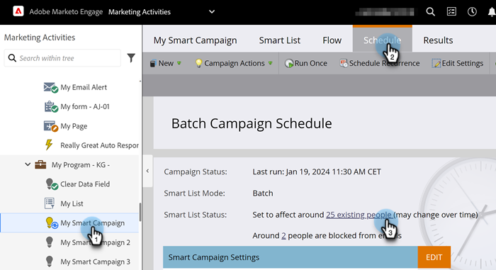
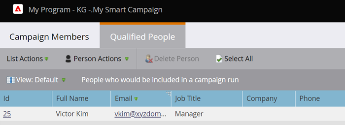

# Ver personas cualificadas en una campaña inteligente {#view-qualified-people-in-a-smart-campaign}

Vea las personas que cumplen los requisitos para pasar por el flujo al ejecutar una campaña inteligente.

1. En su campaña inteligente, haga clic en la ficha **[!UICONTROL Programar]**. En Estado de lista inteligente, haga clic en el primer vínculo.

>[!NOTE]
>
>Déclencheur Las campañas no muestran personas cualificadas, ya que se ejecutan en función de eventos en directo.

1. La ficha **[!UICONTROL Personas calificadas]** enumera las personas que cumplen los requisitos para pasar por el flujo cuando se ejecuta la campaña.

   

   >[!CAUTION]
   >
   >La lista Personas cualificadas no tiene en cuenta las personas bloqueadas o que han alcanzado sus límites de comunicación.

   >[!NOTE]
   >
   >El número de personas cualificadas también depende de las reglas de calificación de campañas inteligentes. Obtenga información sobre cómo [editar reglas de calificación](/help/marketo/product-docs/core-marketo-concepts/smart-campaigns/using-smart-campaigns/edit-qualification-rules-in-a-smart-campaign.md){target="_blank"}.

¡Bonito! Puede utilizar esta lista para comprobar qué personas pueden pasar por el flujo antes de ejecutar una campaña inteligente.

>[!MORELIKETHIS]
>
>* [Ver miembros de campañas inteligentes](/help/marketo/product-docs/core-marketo-concepts/smart-campaigns/smart-campaign-data/view-smart-campaign-members.md){target="_blank"}
>* [Ver personas bloqueadas en una campaña inteligente](/help/marketo/product-docs/core-marketo-concepts/smart-campaigns/smart-campaign-data/view-blocked-people-in-a-smart-campaign.md){target="_blank"}
>* [Agregar un paso de flujo a una campaña inteligente](/help/marketo/product-docs/core-marketo-concepts/smart-campaigns/flow-actions/add-a-flow-step-to-a-smart-campaign.md){target="_blank"}
