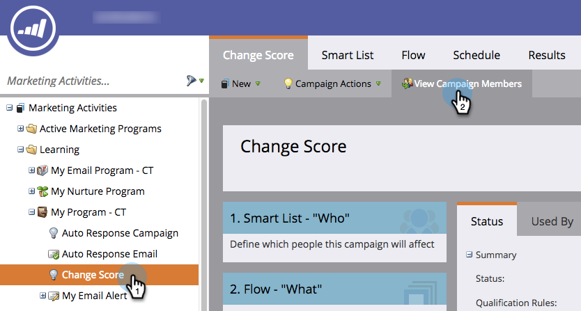

# Ver miembros de campañas inteligentes {#view-smart-campaign-members}

Ver las personas que ya han pasado por el flujo de campañas inteligentes; es decir, miembros inteligentes de la campaña.

1. Vaya a **Marketing Activities**.

1. En la campaña inteligente, haga clic en **Ver miembros de campaña**.

   

>[!TIP]
>
>Puede ver los miembros de la campaña desde cualquier lugar dentro de una campaña inteligente.

1. La pestaña **Miembros de la campaña** muestra las personas que ya han pasado por el flujo de campañas inteligentes.

   

   >[!NOTE]
   >
   >La lista Miembros de la campaña estará vacía inicialmente cuando la campaña inteligente no se haya ejecutado en ninguna persona.

   >[!MORELIKETHIS]
   >
   >[Ver personas bloqueadas en una campaña inteligente](/help/marketo/product-docs/core-marketo-concepts/smart-campaigns/smart-campaign-data/view-blocked-people-in-a-smart-campaign.md)
