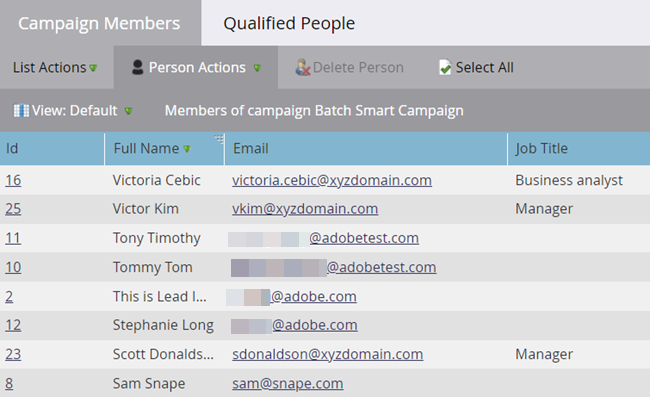

# Ver miembros de la campaña inteligente {#view-smart-campaign-members}

Vea las personas que ya han pasado por el flujo de campaña inteligente.

1. Vaya a **[!UICONTROL Actividades de marketing]**.

   

1. En su campaña inteligente, haga clic en **[!UICONTROL Ver miembros de la campaña]**.

   

   >[!TIP]
   >
   >Puede ver los miembros de la campaña desde cualquier lugar dentro de una campaña inteligente.

1. La pestaña **[!UICONTROL Miembros de la campaña]** muestra a las personas que ya han pasado por el flujo de Campaña inteligente.

   

   >[!NOTE]
   >
   >La lista Miembros de la campaña inicialmente estará vacía cuando la campaña inteligente no se haya ejecutado en ninguna persona.

   >[!MORELIKETHIS]
   >
   >[Ver personas bloqueadas en una campaña inteligente](/help/marketo/product-docs/core-marketo-concepts/smart-campaigns/smart-campaign-data/view-blocked-people-in-a-smart-campaign.md){target="_blank"}
