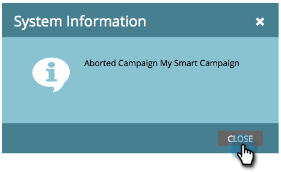

# Anulación de una campaña inteligente {#abort-a-smart-campaign}

>[!CAUTION]
>
>Solo para uso de emergencia

A veces se inicia una campaña inteligente y se da cuenta de inmediato de que fue un error. Así es como tirar del freno de emergencia y detener la campaña inteligente a mitad de carrera.

1. Seleccione la campaña inteligente que desee y haga clic en **[!UICONTROL Programación]** pestaña.

   

1. Haga clic en **[!UICONTROL Acciones de campaña]** menú desplegable. Seleccionar **[!UICONTROL Anular campaña]**.

   

1. Clic **[!UICONTROL Anular]** para confirmar.

   

   >[!NOTE]
   >
   >Anular no deshace los pasos que ya han finalizado, solo evita que se produzcan más (por ejemplo: los correos electrónicos no se pueden cancelar).

   

   >[!NOTE]
   >
   >Eche un vistazo a la **[!UICONTROL Resultados]** de la campaña inteligente para ver qué acciones tuvieron lugar antes de la anulación. También encontrará una  [notificación](/help/marketo/product-docs/core-marketo-concepts/miscellaneous/understanding-notifications.md){target="_blank"} con más detalles.

   >[!TIP]
   >
   >¿Desea eliminar a una persona del flujo en una campaña de déclencheur? Desproteger [Eliminar del flujo](/help/marketo/product-docs/core-marketo-concepts/smart-campaigns/flow-actions/remove-from-flow.md){target="_blank"}.

Siempre vuelva a comprobar su trabajo, pero este freno de emergencia puede ser útil.
