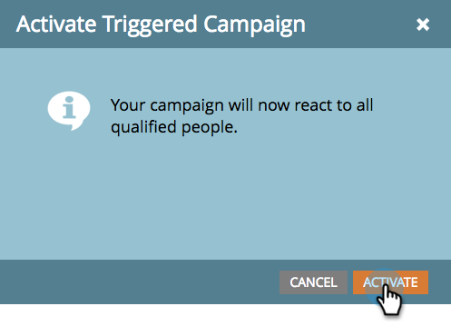

# Activación de una campaña inteligente de activador | Pestaña Programación {#activate-a-trigger-smart-campaign-schedule-tab}

Activar una campaña inteligente de déclencheur es como activarla. Esto es lo que hay que hacer.

1. En la ficha **[!UICONTROL Programar]** de la campaña inteligente, haga clic en **[!UICONTROL Activar]**.

   

   >[!TIP]
   >
   >Revise la campaña inteligente antes de activarla.

1. Vuelva a hacer clic en **[!UICONTROL Activar]**.

   

   >[!TIP]
   >
   >Asegúrese de que la campaña esté lista antes de activarla.

A partir de este momento, cualquier persona que califique para la lista inteligente pasará por el flujo definido por su campaña inteligente.
