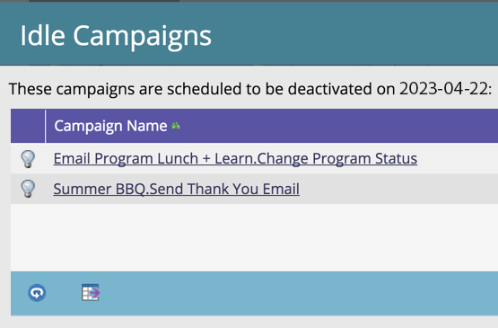

# Limpieza automática de campaña de Déclencheur {#automatic-trigger-campaign-cleanup}

Marketo tiene un servicio agradable/gratuito para desactivar las campañas inteligentes activadas que ya no reciben actividad. Esto acelera el rendimiento general del sistema y le ahorra tiempo.

## ¿Qué pasa? {#what-happens}

Una vez al trimestre, Marketo encontrará campañas inteligentes que han permanecido inactivas (sin personas) durante 6 meses o más y las desactivará.

## ¿Me avisarás primero? {#will-you-notify-me-first}

¡Por supuesto! Una vez al trimestre, recibirá una notificación una semana antes que se mostrarán todas las campañas que planeamos desactivar.

1. Haga clic en **Notificaciones** icono.

   

1. Clic **Limpieza de campaña de Déclencheur inactiva programada**. Luego haga clic en **Se desactivarán estas campañas de Déclencheur inactivas** vínculo.

   

   Verá una lista de campañas inteligentes programadas para desactivarse.

   

## ¿Qué campañas se desactivarán? {#which-campaigns-will-be-deactivated}

Solo desactivaremos las campañas de déclencheur que hayan estado activas durante más de 6 meses pero que hayan tenido 0 personas cualificadas en ese período de tiempo.

## Esperar! ¡Esta campaña no! {#wait-not-this-campaign}

No se preocupe: el reloj de cualquier campaña inteligente se puede restablecer mediante lo siguiente:

* Persona que cumple los requisitos para la campaña.
* Desactivación y reactivación manuales de la campaña.

Cualquiera restablecerá el contador de 6 meses.

## ¿Me permite saber qué campañas se desactivaron? {#will-you-let-me-know-which-campaigns-were-deactivated}

Absolutamente: una semana después de la notificación original, desactivaremos las campañas enumeradas (menos todas que cumplan los requisitos de al menos una persona o que se hayan desactivado/reactivado) y publicaremos una notificación de confirmación.

1. Seleccione el **Limpieza de campaña de Déclencheur inactiva programada** notificación. Haga clic en **Estas campañas de Déclencheur inactivas** vínculo.

   

1. Verá una lista de campañas desactivadas.

   
