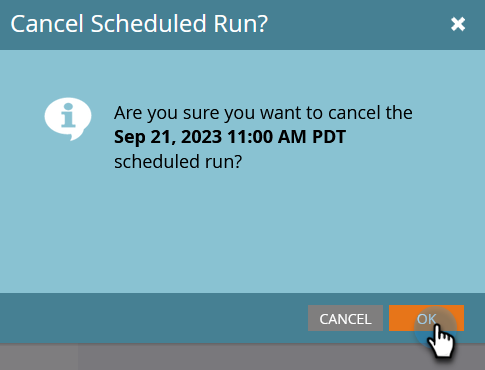

# Cancelar una ejecución de campaña por lotes programada {#cancel-a-scheduled-batch-campaign-run}

Si ha programado una ejecución para una de las campañas por lotes y desea cancelarla, este es el modo.

1. Seleccione la campaña y vaya a **Programación** pestaña.

   

1. Busque la ejecución programada que desea cancelar y haga clic en **x** al lado.

   

1. Confirme la cancelación haciendo clic en **OK**.

   

>[!NOTE]
>
>Hacer esto no ayudará si la ejecución ya se ha iniciado. Utilice esto cuando decida que una ejecución futura debe cancelarse.
