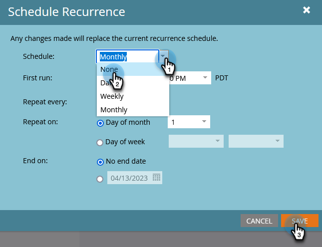

# Cancelar una ejecución programada de campaña por lotes recurrente {#cancel-a-scheduled-recurring-batch-campaign-run}

Si tiene una campaña por lotes recurrente que ya no desea, puede cancelar las ejecuciones futuras. Así es como.

1. Seleccione la campaña inteligente y haga clic en la ficha **Programar**.

   

1. Haga clic en **[!UICONTROL Programar periodicidad]**.

   

   >[!TIP]
   >
   >Puede cancelar una sola ejecución haciendo clic en la  roja junto a ella. Aprenda a [cancelar una ejecución de campaña por lotes programada](/help/marketo/product-docs/core-marketo-concepts/smart-campaigns/using-smart-campaigns/cancel-a-scheduled-batch-campaign-run.md){target="_blank"}.

1. Establezca la programación en **[!UICONTROL None]** y haga clic en **[!UICONTROL Guardar]**.

   

   ¡Voila! La campaña inteligente ya no se ejecutará.

   >[!CAUTION]
   >
   >Esto cancela ejecuciones futuras, pero si una campaña inteligente está en proceso de ejecución, no puede cancelarla.

   >[!MORELIKETHIS]
   >
   >[Cancelar una ejecución programada de campaña por lotes](/help/marketo/product-docs/core-marketo-concepts/smart-campaigns/using-smart-campaigns/cancel-a-scheduled-batch-campaign-run.md){target="_blank"}
