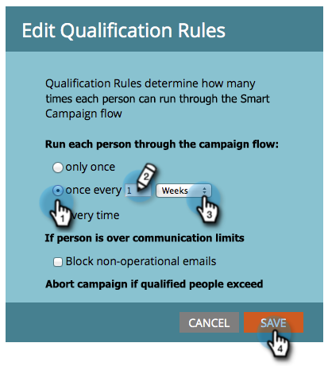

# Edición de reglas de calificación en una campaña inteligente {#edit-qualification-rules-in-a-smart-campaign}

Las reglas de calificación controlan cuántas veces alguien puede correr a través del flujo en una campaña inteligente. De forma predeterminada, incluso si alguien déclencheur una campaña inteligente varias veces, solo se envía a través del flujo una vez.

1. En su campaña inteligente, haga clic en la ficha **[!UICONTROL Programar]** y luego en **[!UICONTROL Editar configuración]**.

   

   >[!TIP]
   >
   >También puede hacer clic en **[!UICONTROL Editar]** a la derecha de &quot;Configuración de campaña inteligente&quot;.

1. Elija la frecuencia con la que ejecutará a sus recursos a través del flujo de campañas inteligentes: **[!UICONTROL solo una vez]**, **[!UICONTROL cada vez]** o **una vez cada # días**/**semanas**/**meses**.

   

   >[!NOTE]
   >
   >* Cuando establece una regla para una vez al día, Marketo la convierte en horas. Por ejemplo, si establece la regla para una vez al día y una persona califica a las 10 p. m. un domingo por la noche, no podrá volver a calificar hasta las 10 p. m. del lunes por la noche. Esta lógica también se aplica cuando se utilizan semanas o meses. Un mes siempre se cuenta como 30 días.
   >
   >* Los límites de comunicación no se aplican a las campañas inteligentes de forma predeterminada. Aprenda a [aplicar límites de comunicación a una campaña inteligente](/help/marketo/product-docs/core-marketo-concepts/smart-campaigns/using-smart-campaigns/apply-communication-limits-to-smart-campaign.md){target="_blank"}.
