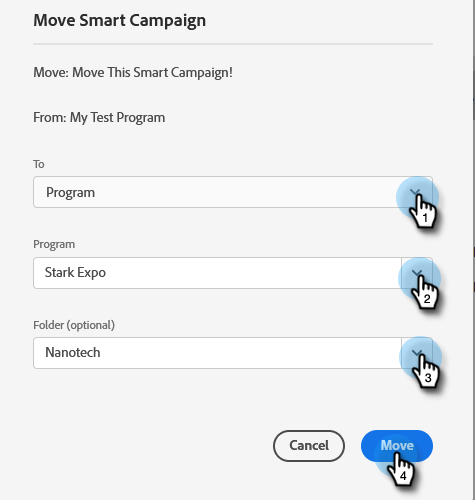

# Mover una campaña inteligente {#move-a-smart-campaign}

Mueva una campaña inteligente entre diferentes programas o carpetas mediante la función de arrastrar y soltar o de mover en el árbol. Las reglas de la campaña inteligente no cambiarán, solo se anidará en un lugar diferente.

>[!CAUTION]
>
>Dado que las reglas no cambiarán, si los pasos de flujo o lista inteligente de la campaña hacen referencia al programa original, debe actualizar manualmente esa información para reflejar su nuevo programa, como lo hará **no** actualización automática.

1. Ir a **Actividades de marketing**.

   

1. Busque la campaña inteligente que desee mover, haga clic con el botón derecho en ella y seleccione **Mover**.

   

1. Seleccione el **Hasta** (destino), **Programa**, y opcional **Carpeta**. Seleccionar **Mover**.

   

   >[!NOTE]
   >
   >En este ejemplo, se mueve la campaña inteligente a otro programa, pero también se puede mover a una carpeta de campaña.

¡Bien hecho! Se ha movido la campaña inteligente.

