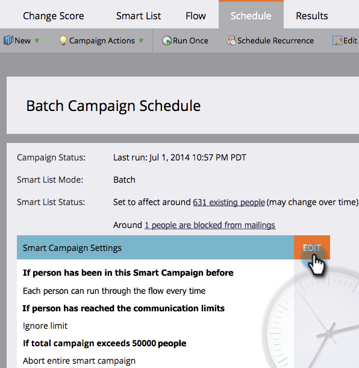

# Anular restricciones de personas en una campaña inteligente {#override-person-restrictions-in-a-smart-campaign}

Marketo le permite establecer el número máximo de personas que pueden cumplir los requisitos para una campaña inteligente; esto le ayuda a evitar enviar por correo electrónico accidentalmente toda la base de datos. Si desea _anular_ este límite, así es como.

>[!PREREQUISITES]
>
>Asegúrese de [habilitar restricciones de persona para campañas inteligentes](/help/marketo/product-docs/administration/email-setup/enable-person-restrictions-for-smart-campaigns.md) en Administración de Marketo.

1. En Actividades de marketing, vaya a la campaña inteligente y haga clic en **Programar**.

   

1. En Configuración de campaña inteligente, haga clic en **Editar**.

   

   >[!NOTE]
   >
   >El límite predeterminado es el establecido en Administración.

1. Escriba un límite nuevo y haga clic en **Guardar.**

   

   La campaña inteligente no se ejecutará si el número de personas que cumplen los requisitos supera el límite establecido.

   >[!CAUTION]
   >
   >Tenga cuidado con esta función para que no incluya accidentalmente demasiadas personas.
