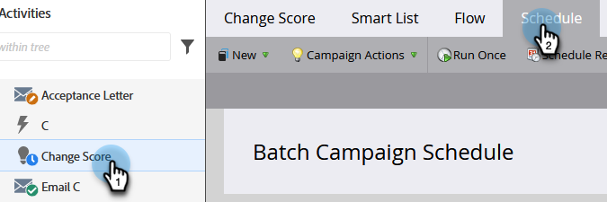

# Anulación de restricciones de persona en una campaña inteligente {#override-person-restrictions-in-a-smart-campaign}

Marketo Engage le permite establecer el número máximo de personas que pueden cumplir los requisitos para una campaña inteligente; esto le ayuda a evitar enviar por correo electrónico accidentalmente toda la base de datos. Si lo desea _invalidar_ este límite, así es como.

>[!PREREQUISITES]
>
>Asegúrese de [habilitar restricciones de persona para campañas inteligentes](/help/marketo/product-docs/administration/email-setup/enable-person-restrictions-for-smart-campaigns.md){target="_blank"} en Administración de Marketo.

1. En Actividades de marketing, vaya a la campaña inteligente y haga clic en **Programación**.

   

1. En Configuración de campaña inteligente, haga clic en **[!UICONTROL Editar]**.

   

   >[!NOTE]
   >
   >El límite predeterminado es el establecido en Administración.

1. Introduzca un nuevo límite y haga clic en **[!UICONTROL Guardar]**.

   

   La campaña inteligente no se ejecutará si el número de personas aptas supera el límite establecido.

   >[!CAUTION]
   >
   >Tenga cuidado con esta función para no incluir accidentalmente a demasiadas personas.
