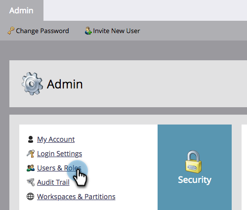
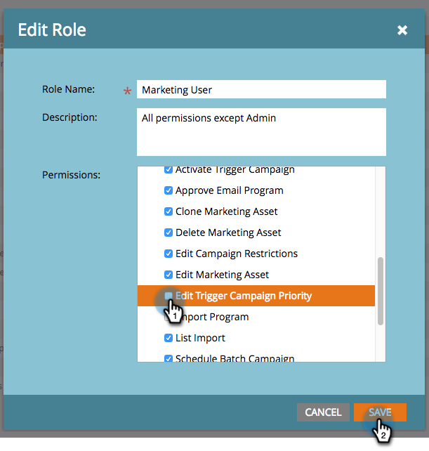

# Anulación de prioridad para campañas de Déclencheur {#priority-override-for-trigger-campaigns}

Los administradores pueden anular la prioridad determinada de Marketo para las campañas de déclencheur a fin de establecer prioridades que se ajusten mejor a los objetivos empresariales.

>[!NOTE]
>
>Esta función solo está disponible para campañas de déclencheur y para los usuarios a los que se les ha concedido la [Permiso &quot;Editar prioridad de campaña de Déclencheur&quot;](#grant-priority-override-access).

>[!CAUTION]
>
>Se recomienda encarecidamente que utilice esta función en un conjunto limitado de campañas críticas para el negocio (el máximo recomendado es 25). El uso de la función de forma flexible en un conjunto grande puede afectar negativamente a la ejecución general de la campaña.

## Conceder acceso de anulación de prioridad {#grant-priority-override-access}

>[!NOTE]
>
>Solo los administradores o usuarios con responsabilidades administrativas deben tener acceso de anulación de la prioridad de campaña.

1. En el [!UICONTROL Administrador] área, haga clic en **[!UICONTROL Usuarios y funciones]**.

   

1. Haga clic en el **[!UICONTROL Funciones]** , seleccione el usuario al que desea conceder acceso y, a continuación, haga clic en **[!UICONTROL Editar función]**.

   

1. En [!UICONTROL Acceso a las actividades de marketing], seleccione **[!UICONTROL Editar prioridad de campaña de Déclencheur]**. Haga clic en **[!UICONTROL Guardar]**.

   

## Invalidar prioridad {#override-priority}

1. Busque la campaña de déclencheur. Haga clic con el botón derecho en ella y seleccione **[!UICONTROL Anular prioridad de campaña]**.

   

1. Haga clic en el **[!UICONTROL Anular prioridad de campaña]** control deslizante para activar. Elija un nuevo nivel de prioridad y haga clic en **[!UICONTROL Confirmar]**.

   

   El nuevo nivel de prioridad se mostrará en la pestaña Schedule .

   

>[!NOTE]
>
>* Puede ver la prioridad predeterminada de la campaña en la [!UICONTROL Cola de campañas] under [!UICONTROL Actividades de marketing]. Para mejorar la tasa de ejecución, se recomienda establecer la prioridad de la campaña en un nivel superior al predeterminado.
>* La prioridad establecida por el usuario solo se aplica a las personas nuevas que cumplen los requisitos para la campaña; las personas que ya estén en cola no se verán afectadas.
>* Las anulaciones de prioridad se capturan en [Pista de auditoría](/help/marketo/product-docs/administration/audit-trail/audit-trail-overview.md).

