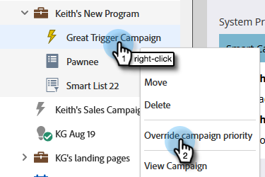

# Anulación de prioridad para campañas de activador {#priority-override-for-trigger-campaigns}

Los administradores pueden anular la prioridad definida por Marketo Engage para las campañas de Déclencheur a fin de establecer prioridades que se ajusten mejor a los objetivos empresariales.

>[!NOTE]
>
>Esta característica solo está disponible para campañas de Déclencheur y para los usuarios a los que se les ha concedido el permiso [&quot;Editar prioridad de campaña de Déclencheur&quot;](#grant-priority-override-access).

>[!CAUTION]
>
>Se recomienda encarecidamente que utilice esta función en un conjunto limitado de campañas críticas para el negocio (25 es el máximo recomendado). El uso de la función en un conjunto grande puede afectar negativamente a la ejecución general de la campaña.

## Conceder acceso de anulación de prioridad {#grant-priority-override-access}

>[!NOTE]
>
>Solo los administradores o usuarios con responsabilidades de administrador deben tener acceso de anulación de prioridad de campaña.

1. En el área **[!UICONTROL Administrador]**, haga clic en **[!UICONTROL Usuarios y roles]**.

   

1. Haga clic en la ficha **[!UICONTROL Roles]**, seleccione el usuario al que desea conceder acceso y, a continuación, haga clic en **[!UICONTROL Editar rol]**.

   

1. En **[!UICONTROL Acceder a actividades de marketing]**, seleccione **[!UICONTROL Editar prioridad de campaña de Déclencheur]**. Haga clic en **[!UICONTROL Guardar]**.

   

## Invalidar prioridad {#override-priority}

1. Busque la campaña de Déclencheur. Haga clic con el botón derecho en él y seleccione **[!UICONTROL Anular prioridad de campaña]**.

   

1. Haga clic en el control deslizante **[!UICONTROL Anular prioridad de campaña]** para habilitar. Elija un nuevo nivel de prioridad y haga clic en **[!UICONTROL Confirmar]**.

   

   El nuevo nivel de prioridad se mostrará en la ficha **[!UICONTROL Programar]**.

   

>[!NOTE]
>
>* Puede ver la prioridad predeterminada de su campaña en [!UICONTROL Cola de campaña] en [!UICONTROL Actividades de marketing]. Para aumentar la tasa de ejecución, recomendamos establecer la prioridad de la campaña en un nivel superior al predeterminado.
>* La prioridad establecida por el usuario solo se aplica a las nuevas personas que cumplen los requisitos para la campaña; las personas que ya están en cola no se verán afectadas.
>* Las invalidaciones de prioridad se capturan en [pista de auditoría](/help/marketo/product-docs/administration/audit-trail/audit-trail-overview.md){target="_blank"}.
