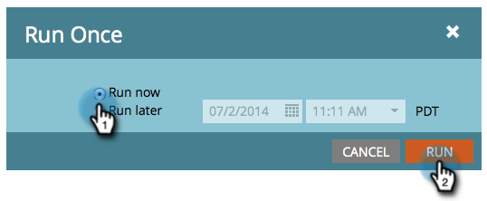

# Ejecutar una campaña inteligente por lotes ahora | Pestaña Programación {#run-a-batch-smart-campaign-now-schedule-tab}

Una vez que haya terminado de crear la campaña por lotes, puede elegir ejecutarla ahora o más tarde.

1. Seleccione la campaña por lotes, vaya a la ficha **[!UICONTROL Programar]** y haga clic en **[!UICONTROL Ejecutar una vez]**.

   

1. Asegúrese de que **[!UICONTROL Ejecutar ahora]** esté seleccionado y haga clic en **[!UICONTROL Ejecutar]**.

   

1. Confirme haciendo clic en **[!UICONTROL Ejecutar]** una vez más.

   

   También puede [programar ejecuciones para más tarde](/help/marketo/product-docs/core-marketo-concepts/smart-campaigns/using-smart-campaigns/schedule-a-batch-smart-campaign-to-run-later.md){target="_blank"}, si lo prefiere.

   >[!NOTE]
   >
   >* [Programar una campaña inteligente por lotes para que se ejecute más tarde](/help/marketo/product-docs/core-marketo-concepts/smart-campaigns/using-smart-campaigns/schedule-a-batch-smart-campaign-to-run-later.md){target="_blank"}
   >* [Programar una campaña por lotes recurrente](/help/marketo/product-docs/core-marketo-concepts/smart-campaigns/using-smart-campaigns/schedule-a-recurring-batch-campaign.md){target="_blank"}
