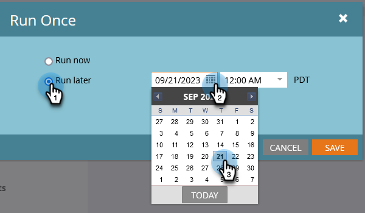
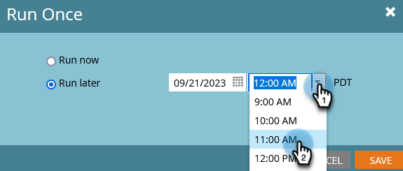

# Programar una campaña inteligente por lotes para que se ejecute más tarde {#schedule-a-batch-smart-campaign-to-run-later}

Si desea configurar una campaña inteligente por lotes para que se ejecute en algún momento futuro, así es.

>[!TIP]
>
>También puede [volver a programar una campaña inteligente por lotes en la vista programación del programa](/help/marketo/product-docs/core-marketo-concepts/programs/program-schedule-view/reschedule-a-batch-smart-campaign-in-the-program-schedule-view.md).

1. Seleccione la campaña inteligente por lotes que desea ejecutar y vaya a **Programación** y haga clic en **Ejecutar una vez**.

   

1. Clic **Ejecutar más tarde**, luego haga clic en el icono de calendario y seleccione el día en el que desea ejecutar la campaña inteligente.

   

1. Seleccione el tiempo en el que desea que se ejecute la campaña inteligente (mínimo 15 minutos antes).

   

1. Clic **Guardar**.

   

1. Puede confirmar la ejecución programada mirando el **Programación** pestaña.

   

   >[!NOTE]
   >
   >[Programar una campaña por lotes recurrente](/help/marketo/product-docs/core-marketo-concepts/smart-campaigns/using-smart-campaigns/schedule-a-recurring-batch-campaign.md)
