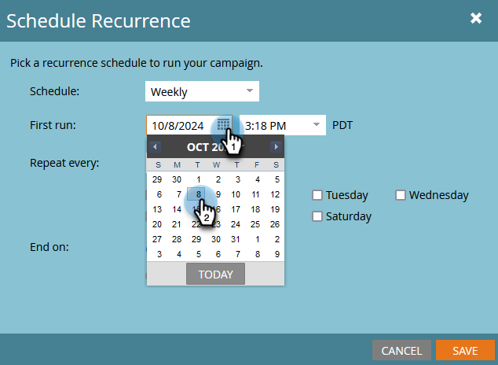
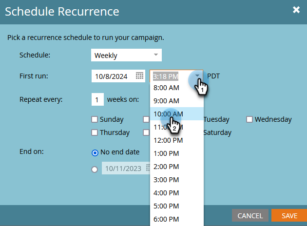

# Programar una campaña por lotes recurrente {#schedule-a-recurring-batch-campaign}

La periodicidad le permite ejecutar una campaña por lotes de forma regular. Por ejemplo: una vez a la semana, los martes a las 10:00 a. m.

1. Seleccione la campaña inteligente, vaya a la pestaña **[!UICONTROL Programar]** y haga clic en **[!UICONTROL Programar periodicidad]**.

   

1. Haga clic en el menú desplegable **[!UICONTROL Programar]** y seleccione **[!UICONTROL Semanal]**.

   

1. Haga clic en el icono de calendario y seleccione el día deseado para la primera ejecución.

   

1. Seleccione la hora a la que debe ejecutarse.

   

1. Deje &quot;[!UICONTROL Repetir cada]&quot; como 1, seleccione Martes y haga clic en **[!UICONTROL Guardar]**.

   

   >[!NOTE]
   >
   >Para una longitud de ejecución específica, puede hacer clic en el icono de calendario junto a **[!UICONTROL Finalizar el]** y elegir la fecha de finalización.

Las periodicidades programadas se muestran en la parte inferior de la pestaña Programación.

>[!NOTE]
>
>La pestaña Schedule muestra las tres instancias siguientes como referencia. Al hacer clic en el **X** rojo, se cancelará esa ejecución específica.
