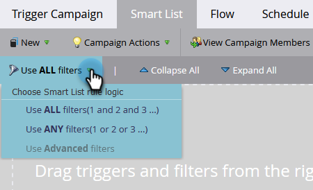

# Uso de la lógica de regla de listas inteligentes estándar {#using-standard-smart-list-rule-logic}

Es posible que haya visto la opción &quot;Usar filtros&quot; al crear listas inteligentes de campaña. Esta configuración le permite decidir si los filtros deben evaluarse con un operador AND u OR.



>[!NOTE]
>
>El cambio de la lógica de reglas de listas inteligentes solo se aplica a los déclencheur, _no_.

Los déclencheur siempre se evalúan como O incluso si el ajuste anterior está establecido en TODO. Por ejemplo:


La lista inteligente anterior en palabras:

```box
IF person fills out Great Form
OR
IF person visits Keith's Landing Page
AND
Industry is Energy
AND
Country is US
THEN follow the campaign's flow step(s)
```

Por lo tanto, si una persona rellena el formulario _o_ visita la página, la campaña evaluará a esa persona en función de _todos_ o _cualquiera_ de los filtros subsiguientes, según la configuración utilizada.

>[!MORELIKETHIS]
>
>[Usando lógica avanzada de reglas de listas inteligentes](/help/marketo/product-docs/core-marketo-concepts/smart-lists-and-static-lists/using-smart-lists/using-advanced-smart-list-rule-logic.md){target="_blank"}
