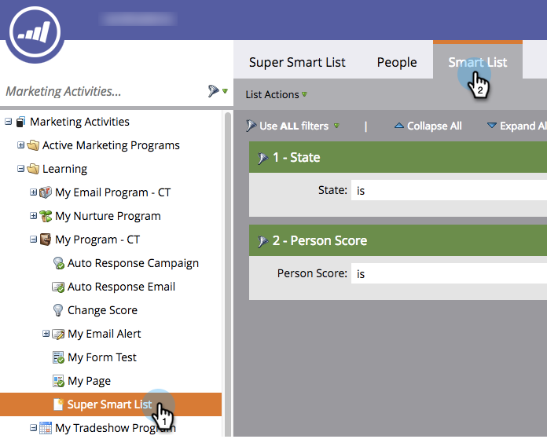
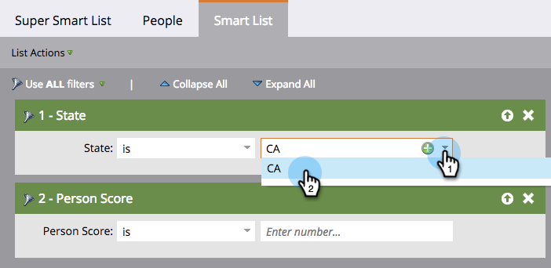

# Definir filtros de lista inteligente {#define-smart-list-filters}

>[!PREREQUISITES]
>
>* [Crear una lista inteligente](create-a-smart-list.md)
>* [Buscar y agregar filtros a listas inteligentes](find-and-add-filters-to-a-smart-list.md)

Ahora que ha [creado una lista inteligente](/help/marketo/product-docs/core-marketo-concepts/smart-lists-and-static-lists/creating-a-smart-list/create-a-smart-list.md) y [añadido filtros](/help/marketo/product-docs/core-marketo-concepts/smart-lists-and-static-lists/creating-a-smart-list/find-and-add-filters-to-a-smart-list.md), vamos a definir los filtros. Así es como.

Siguiendo con nuestro ejemplo, defina estos filtros para encontrar todas las personas en California con una puntuación superior a 50.

1. Vaya a **Marketing Activities**.

   

1. Seleccione la lista inteligente y haga clic en la pestaña **Smart List**.

   

1. Busque y seleccione **CA** para el filtro **State**.

   

   >[!NOTE]
   >
   >Puede que esté almacenando **California** y **CA**. Para filtrar por ambos valores e incluir _todas_ las personas de California, aprenda a [agregar varios valores a un filtro de lista inteligente](/help/marketo/product-docs/core-marketo-concepts/smart-lists-and-static-lists/using-smart-lists/add-multiple-values-to-a-smart-list-filter.md).

1. Elija el operador **bueno que** e introduzca **50**.

   

   ¡Felicidades! Ahora sabe cómo crear una lista inteligente y añadir/definir filtros.
