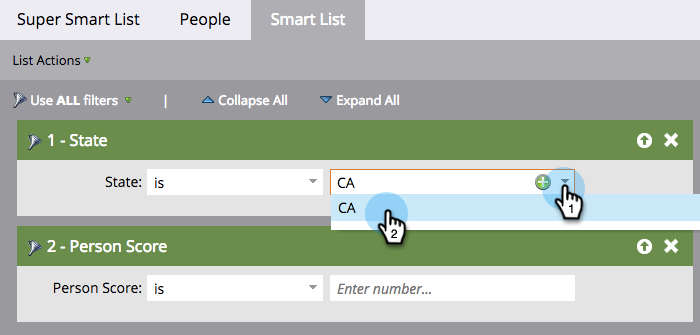

# Definición de filtros de listas inteligentes {#define-smart-list-filters}

>[!PREREQUISITES]
>
>* [Crear una lista inteligente](/help/marketo/product-docs/core-marketo-concepts/smart-lists-and-static-lists/creating-a-smart-list/create-a-smart-list.md){target="_blank"}
>* [Buscar y agregar filtros a listas inteligentes](/help/marketo/product-docs/core-marketo-concepts/smart-lists-and-static-lists/creating-a-smart-list/find-and-add-filters-to-a-smart-list.md){target="_blank"}

Ahora que ha [creado una lista inteligente](/help/marketo/product-docs/core-marketo-concepts/smart-lists-and-static-lists/creating-a-smart-list/create-a-smart-list.md){target="_blank"} y [agregado filtros](/help/marketo/product-docs/core-marketo-concepts/smart-lists-and-static-lists/creating-a-smart-list/find-and-add-filters-to-a-smart-list.md){target="_blank"} a ella, vamos a definir los filtros. Así es como.

Continuando con nuestro ejemplo, definamos estos filtros para encontrar todas las personas en California con una puntuación superior a 50.

1. Vaya a **[!UICONTROL Actividades de marketing]**.

   

1. Seleccione la lista inteligente que desee y haga clic en la ficha **[!UICONTROL Lista inteligente]**.

   

1. Busque y seleccione &quot;CA&quot; para el filtro **[!UICONTROL Estado]**.

   

   >[!NOTE]
   >
   >Es posible que almacene tanto &quot;California&quot; como &quot;CA&quot;. Para filtrar ambos valores e incluir _todas_ las personas de California, aprenda a [agregar varios valores a un filtro de listas inteligentes](/help/marketo/product-docs/core-marketo-concepts/smart-lists-and-static-lists/using-smart-lists/add-multiple-values-to-a-smart-list-filter.md){target="_blank"}.

1. Elija el operador **[!UICONTROL greater than]** y escriba &quot;50&quot;.

   

>[!TIP]
>
>Si cree que puede tener algunos registros en la base de datos que contienen direcciones de correo electrónico incompletas (por ejemplo, &quot;@adobe.com&quot;), utilice dos filtros de dirección de correo electrónico cuando utilice el operador &quot;contains&quot;. Un filtro con &quot;contiene @adobe.com&quot; y un filtro independiente con &quot;contiene adobe.com&quot; (excluyendo el símbolo @).

Ahora sabe cómo crear una lista inteligente y agregar o definir filtros.
