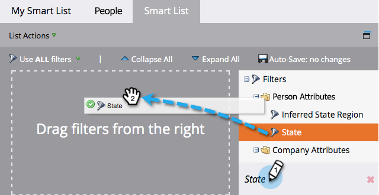
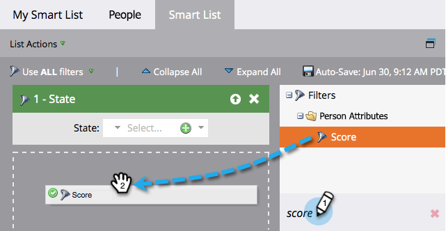

# Buscar y añadir filtros a una lista inteligente {#find-and-add-filters-to-a-smart-list}

Después de [crear una lista inteligente](/help/marketo/product-docs/core-marketo-concepts/smart-lists-and-static-lists/creating-a-smart-list/create-a-smart-list.md){target="_blank"}, debe agregar y [definir](/help/marketo/product-docs/core-marketo-concepts/smart-lists-and-static-lists/creating-a-smart-list/define-smart-list-filters.md){target="_blank"} filtros.

En este ejemplo, el objetivo es encontrar todas las personas en California con una puntuación superior a 50.

>[!TIP]
>
>Explore el árbol de la derecha: los filtros son muy potentes y tienen una amplia variedad de funciones posibles.

1. Vaya a **[!UICONTROL Actividades de marketing]**.

   

1. Seleccione la lista inteligente a la que desee agregar filtros y haga clic en la ficha **[!UICONTROL Lista inteligente]**.

   

1. Busque y arrastre el filtro **[!UICONTROL State]** al lienzo.

   

1. Busque y arrastre también el filtro **[!UICONTROL Puntuación]**.

   

Defina estos filtros.

>[!MORELIKETHIS]
>
>* [Crear una lista inteligente](/help/marketo/product-docs/core-marketo-concepts/smart-lists-and-static-lists/creating-a-smart-list/create-a-smart-list.md){target="_blank"}
>* [Definir filtros de listas inteligentes](/help/marketo/product-docs/core-marketo-concepts/smart-lists-and-static-lists/creating-a-smart-list/define-smart-list-filters.md){target="_blank"}
