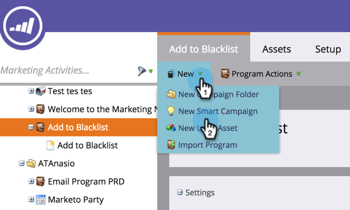

# Agregar persona a Lista de bloqueados {#add-person-to-blocklist}

Añadir personas a la Lista de bloqueados impide que reciban su correspondencia.

>[!NOTE]
>
>Marketo está cambiando términos como Lista negra y Lista blanca a Lista de bloqueados y Lista de permitidos en nuestro producto. Durante esta actualización, es posible que vea los términos antiguos en nuestra interfaz de usuario y en las capturas de pantalla de la documentación, así como los términos nuevos en nuestro texto de documentación. Pedimos disculpas por cualquier confusión.

1. [Cree un nuevo ](/help/marketo/product-docs/core-marketo-concepts/programs/creating-programs/create-a-program.md) programa predeterminado y asígnele el nombre  **Añadir a la Lista de bloqueados**.

1. Haga clic en **Nuevo** y seleccione **Nuevo recurso local**.

   

1. Asigne un nombre a la lista y haga clic en **Create**.

   

1. Agregue todas las personas a la **Lista inteligente** que desee agregar a la Lista de bloqueados.

   >[!NOTE]
   >
   >Las personas de la Lista de bloqueados no recibirán correos electrónicos operativos.

   

1. Haga clic en **New** y seleccione **New Smart Campaign**.

   

1. Asigne un nombre a la **Nueva campaña inteligente**. Haga clic en **Crear**.

   

1. Arrastre y suelte **Member of Smart List**.

   

1. Seleccione la lista inteligente que acaba de crear.

   

1. Arrastre y suelte **Cambiar valor de datos**.

   

1. Para el **Flujo**, introduzca **Bloque listado** para el **Atributo** y establezca **Nuevo valor** en **true**.

   

1. En la pestaña **Schedule**, seleccione **Run Once**.

   

1. Seleccione **Ejecutar ahora** y haga clic en **Ejecutar**.

   

   ¡YAY! Estas personas ya no recibirán correos electrónicos.

   >[!TIP]
   >
   >Cree una [campaña inteligente de déclencheur](/help/marketo/product-docs/core-marketo-concepts/smart-campaigns/creating-a-smart-campaign/create-a-new-smart-campaign.md) utilizando **Cambiar valor de datos** con **Bloque enumerado es verdadero** para todas las personas en el futuro que tengan atributos que puedan lista de bloqueados.
