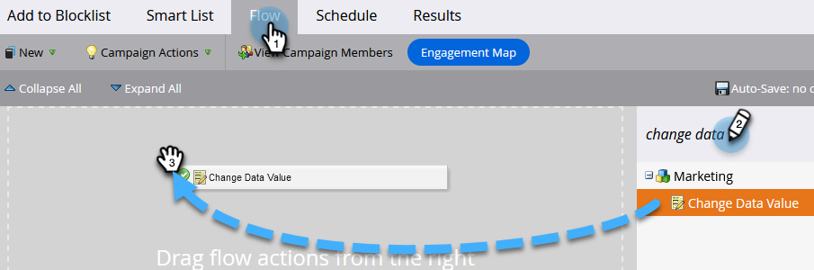
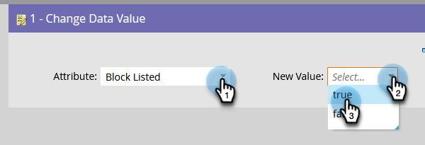

# Añadir persona a la Lista de bloqueados {#add-person-to-blocklist}

Agregar personas a la Lista de bloqueados impide que reciban la correspondencia.

1. Crear un nuevo [programa predeterminado](/help/marketo/product-docs/core-marketo-concepts/programs/creating-programs/create-a-program.md){target="_blank"} y asígnele el nombre &quot;Agregar a Lista de bloqueados&quot;.

1. Clic **[!UICONTROL Nuevo]** y seleccione **[!UICONTROL Nuevo recurso local]**.

   

1. Seleccionar **[!UICONTROL Lista inteligente]**.

   

1. Asigne un nombre a la lista y haga clic en **[!UICONTROL Crear]**.

   

1. Agregue todas las personas a la lista inteligente que desee agregar a la Lista de bloqueados.

   

   >[!NOTE]
   >
   >Las personas de su Lista de bloqueados no recibirán correos electrónicos operativos.

1. Vuelva a su programa.

   

1. Clic **[!UICONTROL Nuevo]** y seleccione **[!UICONTROL Nueva campaña inteligente]**.

   

1. Asigne un nombre a la nueva campaña inteligente. Haga clic en **[!UICONTROL Crear]**.

   

1. Arrastrar y soltar **[!UICONTROL Miembro de lista inteligente]**.

   

1. Seleccione la lista inteligente que acaba de crear.

   

1. Haga clic en **[!UICONTROL Flujo]** pestaña. Arrastre y suelte el **[!UICONTROL Cambiar valor de datos]** Acción de flujo.

   

1. En el **[!UICONTROL Atributo]** selección desplegable **[!UICONTROL Bloquear enumerados]** y establecer **[!UICONTROL Nuevo valor]** hasta **[!UICONTROL true]**.

   

1. Haga clic en **[!UICONTROL Programación]** y seleccione **[!UICONTROL Ejecutar una vez]**.

   

1. Seleccionar **[!UICONTROL Ejecutar ahora]** y haga clic en **[!UICONTROL Ejecutar]**.

   

1. Clic **[!UICONTROL Ejecutar]** otra vez.

   

Estas personas ya no recibirán correos electrónicos.

>[!TIP]
>
>Crear un [Campaña de déclencheur](/help/marketo/product-docs/core-marketo-concepts/smart-campaigns/creating-a-smart-campaign/create-a-new-smart-campaign.md){target="_blank"} usando **Cambiar valor de datos** con **Bloquear en la lista es verdadero** para todas las personas del futuro que tengan atributos que permitan la lista de bloqueados.
