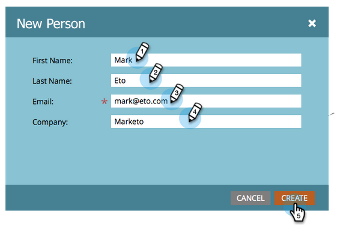

# Crear una persona manualmente {#create-a-person-manually}

Hay muchas maneras de hacer que una persona entre en Marketo Engage. Si necesita crear uno manualmente, así es como hacerlo.

>[!CAUTION]
>
>Marketo no admite direcciones de correo electrónico que contengan emojis.

1. Ir a **[!UICONTROL Base de datos]**.

   

1. En **[!UICONTROL Nuevo]**, haga clic en **[!UICONTROL Nueva persona]**.

   

1. Escriba la información de la persona y haga clic en **[!UICONTROL Crear]**.

   
