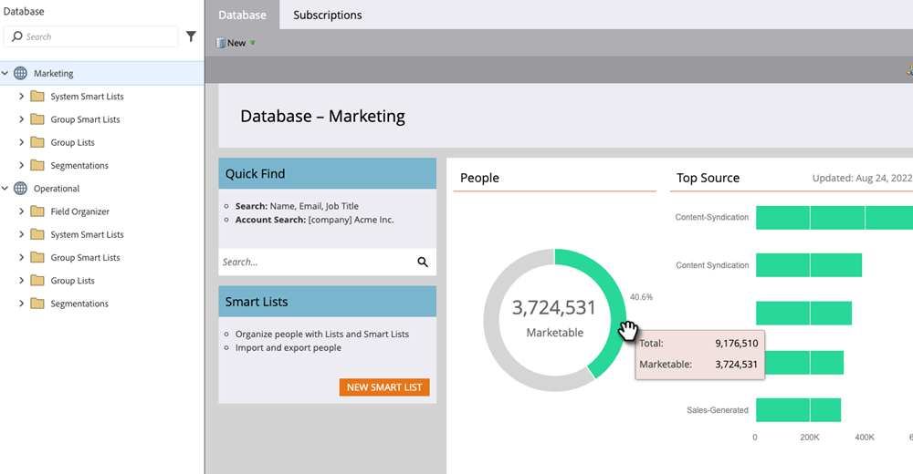

# Panel de la base de datos {#database-dashboard}

El tablero de base de datos sirve como instantánea para ayudarle a determinar rápidamente los atributos clave sobre sus recursos en un espacio de trabajo.

>[!NOTE]
>
>* El tablero de la base de datos se actualiza automáticamente cada 24 a 32 horas. Puede realizar una actualización manual en cualquier momento haciendo clic en el texto &quot;última actualización&quot; que aparece a la derecha de la pantalla.
>
>* Cada espacio de trabajo tiene su propio panel de base de datos.

Para llegar allí, selecciona **[!UICONTROL Base de datos]** de tu My Marketo.

Los gráficos indican la cantidad total de personas, la cantidad de personas comercializables, así como las cinco fuentes principales de adquisición de personas. Pase el ratón sobre las zonas verdes para ver más detalles.

>[!TIP]
>
>Para obtener información más específica u oportuna sobre su personal, pruebe con un [Informe de rendimiento de personas](/help/marketo/product-docs/reporting/basic-reporting/report-types/people-performance-report.md){target="_blank"}.

**Personas totales:** Cantidad de personas permanentes para el área de trabajo enumerada.

**Personas comercializables:** El número de personas de todo el tiempo para el espacio de trabajo enumerado, _menos las siguientes_: personas sin dirección de correo electrónico, personas cuyo correo electrónico ha rebotado con fuerza, personas incluidas en la lista de bloqueados, personas que han cancelado su suscripción, personas actualmente configuradas como Marketing suspendido.
