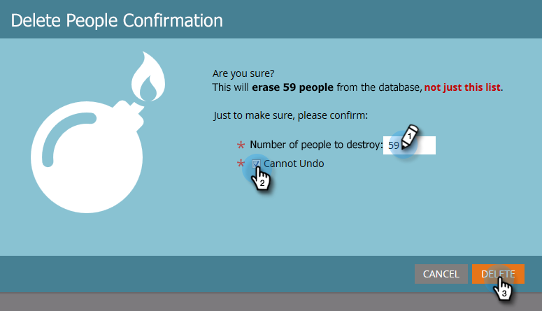

# Eliminar personas de una lista inteligente o una lista {#delete-people-in-a-smart-list-or-list}

Puede eliminar rápida y fácilmente algunas o todas las personas de una lista o lista inteligente.

>[!PREREQUISITES]
>
>[Crear una lista inteligente](/help/marketo/product-docs/core-marketo-concepts/smart-lists-and-static-lists/creating-a-smart-list/create-a-smart-list.md)

1. Ir a **Actividades de marketing**.

   

1. Seleccione la lista o lista inteligente que contiene todas las personas que desea eliminar y vaya a **People** pestaña.

   

   >[!CAUTION]
   >
   >Al eliminar a una persona, no solo la está eliminando de la lista, sino que se eliminará completamente de la base de datos.

1. Clic **Seleccionar todo**. También puede elegir manualmente algunos registros utilizando Ctrl/Cmd y haciendo clic en.

   

   >[!NOTE]
   >
   >Si los resultados se extienden por varias páginas, haga clic en **Seleccionar todo** seleccionará todas las personas en todas las páginas.

1. Para eliminar completamente a las personas de Marketo, haga clic en **Eliminar persona**.

   

1. Establecer **Eliminar de CRM** hasta **true** si también desea eliminar los registros de su CRM.

   

   >[!CAUTION]
   >
   >Eliminar de Marketo y de su CRM significa que nunca podrá recuperarse en ninguno de los sistemas. El pueblo y sus historias desaparecerán para siempre. Si los vuelve a agregar más tarde, se tratarán como registros completamente nuevos.

   >[!NOTE]
   >
   >Si el Marketo no está vinculado a su CRM, la opción aparece atenuada como en la captura de pantalla.

1. Clic **Ejecutar ahora**.

   

1. Si va a eliminar más de 50 personas, verá esto. Escriba el número de personas que está eliminando y marque la opción **No se puede deshacer** y haga clic en **Eliminar**.

   

   >[!NOTE]
   >
   >Para ver los resultados de la eliminación masiva, haga clic en **Ver resultados** en el cuadro emergente Acción de flujo único, en la esquina superior derecha de la pantalla. Los tiempos de eliminación pueden variar considerablemente, según varios factores.

   Esta es una buena característica, ¡tenga mucho cuidado al usarla!
