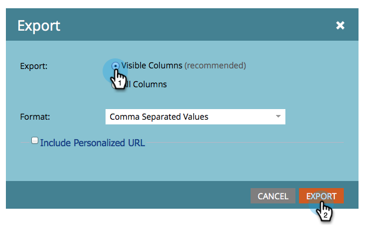

# Exportar personas a Excel desde una lista o lista inteligente {#export-people-to-excel-from-a-list-or-smart-list}

Si necesita resultados de listas o listas inteligentes fuera de Marketo, puede exportarlos a Excel.

1. Vaya a **[!UICONTROL Actividades de marketing]**.

   

1. Seleccione la lista o la lista inteligente que desee exportar y vaya a la ficha **[!UICONTROL Personas]**.

   

1. Hacia la parte inferior de la página, haga clic en el icono de Excel.

   

1. Seleccione **[!UICONTROL Columnas visibles]** y haga clic en **[!UICONTROL Exportar]**.

   

   >[!NOTE]
   >
   >Si elige **[!UICONTROL Todas las columnas]**, la exportación será más grande y tardará más en generarse o descargarse.

   >[!TIP]
   >
   >Si los registros personales contienen caracteres extranjeros que no se representan correctamente al exportar, intente cambiar el tipo de archivo en la lista desplegable **[!UICONTROL Formato]**.

1. Se ejecutará la exportación. Una vez finalizado, puede hacer clic en **[!UICONTROL Descargar ahora]** para obtener el archivo.

   

   >[!TIP]
   >
   >Si la exportación está tardando un tiempo, siempre puede cerrar la sesión y volver a ella más tarde. Se puede acceder al vínculo **[!UICONTROL Descargar ahora]** seleccionando **[!UICONTROL Mostrar estado de exportación]** en el menú **[!UICONTROL Enumerar acciones]**, y es válido durante una semana.
