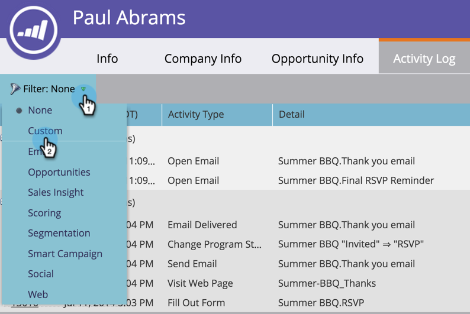

# Filtrar tipos de actividades en el registro de actividad de una persona {#filter-activity-types-in-the-activity-log-of-a-person}

Busque las actividades que más le importen en el registro de actividades.

>[!NOTE]
>
>Más información acerca de [el registro de actividad](/help/marketo/product-docs/core-marketo-concepts/smart-lists-and-static-lists/managing-people-in-smart-lists/locate-the-activity-log-for-a-person.md){target="_blank"}.

1. Vaya a la página Detalles de la persona. Haga clic en la ficha **[!UICONTROL Registro de actividades]**.

   

1. Seleccione la lista desplegable **[!UICONTROL Filtro]**.

   

## Creación de filtros personalizados {#creating-custom-filters}

1. Haga clic en la lista desplegable **[!UICONTROL Filtro]**. Seleccione **[!UICONTROL Personalizado]**.

   

1. Seleccione las actividades por las que filtrar. Haga clic en **[!UICONTROL Guardar como]**.

   

1. Escriba un **[!UICONTROL nombre de filtro personalizado]**. Haga clic en **[!UICONTROL Guardar]**.

   

   Ahora solo se muestran las actividades de persona que cumplen los criterios del filtro.

   

## Filtros guardados de referencia {#reference-saved-filters}

Se puede acceder a los filtros guardados desde la lista desplegable [!UICONTROL Filtro].

1. Haga clic en la lista desplegable **[!UICONTROL Filtros]**. Seleccione **[!UICONTROL Personalizado]**.

   

1. Haga clic en **[!UICONTROL Filtros guardados]**. Los filtros guardados se enumeran a continuación.

   
