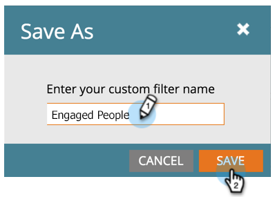

# Filtrar tipos de actividades en el registro de actividad de una persona {#filter-activity-types-in-the-activity-log-of-a-person}

Busque las actividades que más le importen en el registro de actividades.

>[!NOTE]
>
>Más información sobre [el registro de actividad](/help/marketo/product-docs/core-marketo-concepts/smart-lists-and-static-lists/managing-people-in-smart-lists/locate-the-activity-log-for-a-person.md).

1. Vaya a la **Detalles de persona** página. Haga clic en **Registro de actividad** pestaña.

   

1. Seleccione el **Filtrar** menú desplegable.

   

## Creación de filtros personalizados {#creating-custom-filters}

1. Haga clic en **Filtrar** menú desplegable. Seleccionar **Personalizado**.

   

1. Seleccione las actividades por las que filtrar. Clic **Guardar como**.

   

1. Introduzca una **nombre de filtro personalizado**. Clic **Guardar**.

   

   Ahora solo se muestran las actividades de persona que cumplen los criterios del filtro.

   

## Filtros guardados de referencia {#reference-saved-filters}

Se puede acceder a los filtros guardados desde el **Filtrar** menú desplegable.

1. Haga clic en **Filtros** menú desplegable. Seleccionar **Personalizado**.

   

1. Clic **Filtros guardados**. Los filtros guardados se enumeran a continuación.

   
