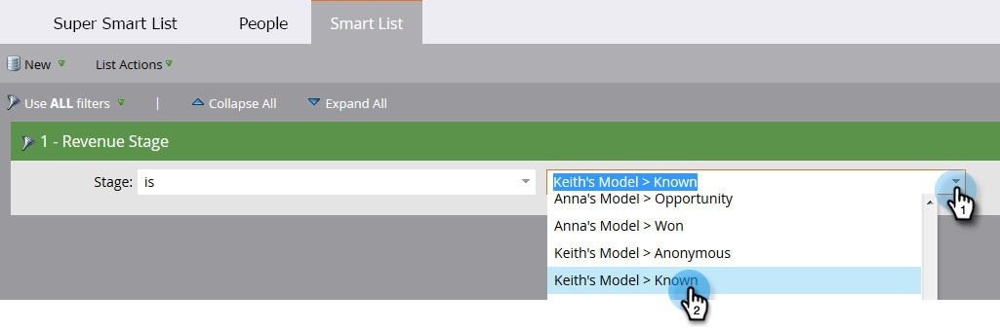

# Buscar todas las personas en una etapa de ingresos {#find-all-people-in-a-revenue-stage}

>[!PREREQUISITES]
>
>[Crear una lista inteligente](/help/marketo/product-docs/core-marketo-concepts/smart-lists-and-static-lists/creating-a-smart-list/create-a-smart-list.md)

## Buscar todos los miembros de una fase de ingresos específica {#find-all-members-of-a-specific-revenue-stage}

1. En una lista inteligente, haga clic en el **Lista inteligente** , busque la **Etapa de ingresos** y arrástrela al lienzo.

   

1. Seleccione un **Etapa de ingresos**.

   

1. Vaya a la **People** para ver los resultados.

   

## Ejecutar un paso de flujo en los miembros de una fase de ingresos {#run-a-flow-step-on-the-members-of-a-revenue-stage}

Ahora que saben qué personas están en qué etapas de ingresos, pueden comercializar directamente con ellas. Además de elegir **Etapa de ingresos** como filtro de lista inteligente, también puede elegirlo como filtro &quot;if&quot; en el flujo.

1. En el paso de flujo deseado, haga clic en **Agregar opción** y seleccione **Etapa de ingresos** en la lista desplegable .

   

   Desde allí puede elegir qué miembros se ven afectados por qué aspecto del paso de flujo. ¡Diversión!
