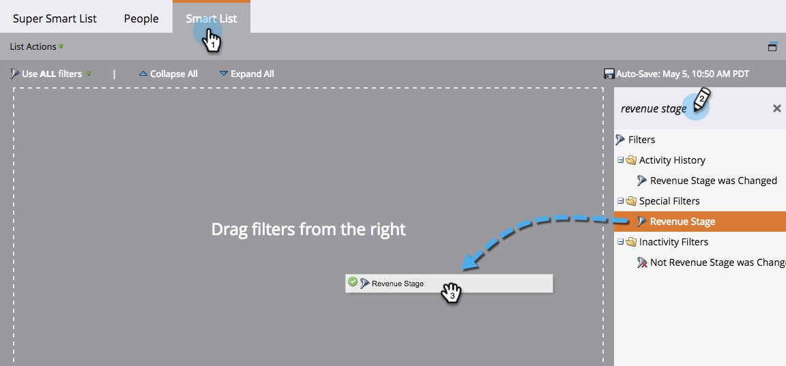
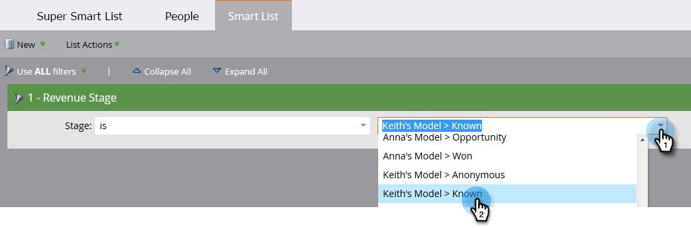

# Buscar todas las personas en una fase de ingresos {#find-all-people-in-a-revenue-stage}

>[!PREREQUISITES]
>
>[Crear una lista inteligente](/help/marketo/product-docs/core-marketo-concepts/smart-lists-and-static-lists/creating-a-smart-list/create-a-smart-list.md){target="_blank"}

## Buscar todos los miembros de una etapa de ingresos específica {#find-all-members-of-a-specific-revenue-stage}

1. En una lista inteligente, haga clic en la ficha **[!UICONTROL Lista inteligente]**, busque el filtro **[!UICONTROL Fase de ingresos]** y arrástrelo al lienzo.

   

1. Seleccione una **[!UICONTROL etapa de ingresos]**.

   

1. Vaya a la ficha **[!UICONTROL Personas]** para ver los resultados.

   

## Ejecutar un paso de flujo en los miembros de una fase de ingresos {#run-a-flow-step-on-the-members-of-a-revenue-stage}

Ahora que sabe qué personas están en qué etapas de ingresos, puede comercializarlas directamente. Además de elegir **[!UICONTROL Ingreso Stage]** como filtro de lista inteligente, también puede elegirlo como filtro &quot;if&quot; en el flujo.

1. En el paso de flujo deseado, haga clic en **[!UICONTROL Agregar opción]** y seleccione **[!UICONTROL Etapa de ingresos]** en la lista desplegable.

   

   Desde allí puede elegir qué miembros se ven afectados por qué aspecto del paso de flujo.
