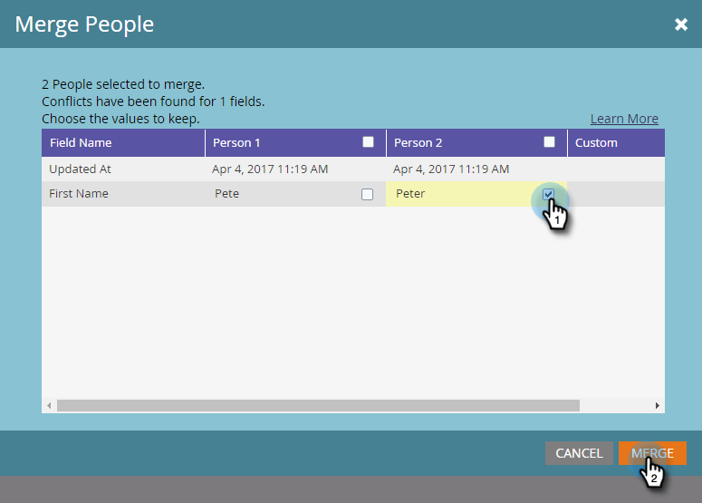

# Buscar y combinar personas duplicadas {#find-and-merge-duplicate-people}

Marketo anula automáticamente la duplicación cuando entran nuevos usuarios al sistema. Sin embargo, es posible que su CRM haya enviado duplicados inicialmente a Marketo. Así es como fusionarlos.

>[!NOTE]
>
>Marketo no desduplicará automáticamente con una sincronización de Salesforce o Microsoft Dynamics, o cuando introduzca personas manualmente.

>[!PREREQUISITES]
>
>La búsqueda y combinación de duplicados implicará el uso de [listas inteligentes integradas/del sistema](/help/marketo/product-docs/core-marketo-concepts/smart-lists-and-static-lists/using-smart-lists/use-built-in-system-smart-lists.md).

## Buscar duplicados {#find-duplicates}

1. Vaya al área **Database**.

   

   >[!CAUTION]
   >
   >Es posible que la combinación de personas en Marketo no funcione si utiliza una cuenta de persona de Salesforce. Si es posible, combine los registros en Salesforce.

1. Seleccione la lista inteligente del sistema **Posibles duplicados** y haga clic en la pestaña **Personas**.

   

   >[!NOTE]
   >
   >También puede [Buscar personas duplicadas con lógica personalizada](/help/marketo/product-docs/core-marketo-concepts/smart-lists-and-static-lists/managing-people-in-smart-lists/find-duplicate-people-with-custom-logic.md).

## Combinar usuarios manualmente {#merge-people-manually}

>[!CAUTION]
>
>Al combinar personas, si la persona perdedora tiene un objeto personalizado de Marketo, **no** se vuelve a asociar a la persona ganadora. Vuelva a primario con el objeto personalizado antes de realizar la combinación.

1. Para seleccionar los duplicados, mantenga presionada la tecla Ctrl/Cmd y haga clic en y, a continuación, haga clic en **Combinar personas**.

   

   >[!TIP]
   >
   >Puede tener dos o más duplicados para la misma persona: selecciónelos todos a la vez.

1. Verá los valores entre los registros que _no coinciden_. Seleccione el valor que desee conservar para cada campo. Haga clic en **Combinar** cuando termine. Si no desea ninguno de estos valores, puede marcar **Custom** e introducir un valor de su elección.

   

   >[!NOTE]
   >
   >Al combinar manualmente personas, la primera persona seleccionada será la &quot;ganadora&quot;. Por lo tanto, en la ficha Personas, si combina los ID de registro 198 y 199, y hace clic en 199 primero, 199 será el ID de registro de las personas fusionadas. Esto también se aplica si se combinan más de dos registros.

   >[!TIP]
   >
   >La combinación es mejor que la eliminación. Conservará todo el historial (visitas de página, clics en vínculos, aperturas de correo electrónico, rellenos de formulario, etc.).

## Efecto en Salesforce {#effect-in-salesforce}

Si tiene integración con Salesforce, hay algunas notas sobre el efecto de Fusionar posibles clientes en Salesforce.

* Al combinar solo posibles clientes o solo contactos, se fusionan según las reglas normales de Salesforce.
* Al combinar Leads y Contactos, todos los Leads se convierten a Contactos antes de fusionarse según las reglas normales de Salesforce.

Para conocer los detalles del comportamiento de Salesforce al combinar posibles clientes o contactos, consulte los siguientes documentos de Salesforce:

* [Combinación de posibles clientes duplicados](https://help.salesforce.com/HTViewHelpDoc?id=leads_merge.htm&amp;language=en_US)
* [Combinación de contactos duplicados](https://help.salesforce.com/HTViewHelpDoc?id=contacts_merge.htm&amp;language=en_US)

## Combinación masiva {#bulk-merging}

Si tiene demasiados duplicados para combinar manualmente, póngase en contacto con el administrador de éxito del cliente para analizar sus opciones.

¡Super! Si está conectado a un CRM, los registros se fusionarán allí según las reglas siguientes.
