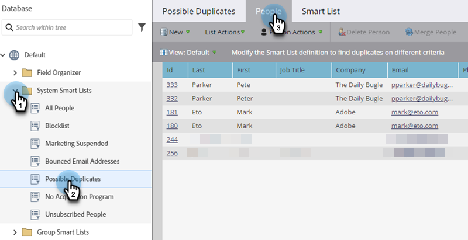
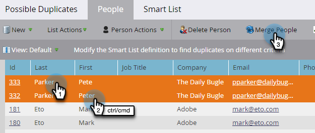
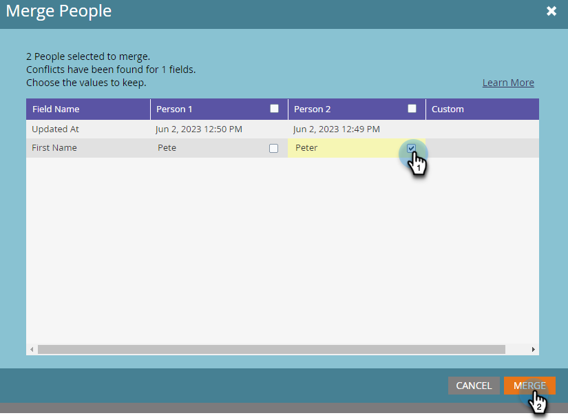

# Buscar y combinar personas duplicadas {#find-and-merge-duplicate-people}

Marketo Engage anula la duplicación automáticamente cuando nuevas personas entran en el sistema. Sin embargo, es posible que su CRM haya enviado inicialmente duplicados.

>[!CAUTION]
>
>La combinación de personas es permanente, no hay opción de deshacer.

>[!PREREQUISITES]
>
>La búsqueda y combinación de duplicados implica el uso de [listas inteligentes integradas/del sistema](/help/marketo/product-docs/core-marketo-concepts/smart-lists-and-static-lists/using-smart-lists/use-built-in-system-smart-lists.md){target="_blank"}.

>[!NOTE]
>
>Marketo no desduplicará automáticamente una sincronización de [!DNL Salesforce] o [!DNL Microsoft Dynamics], ni cuando se introduzcan personas manualmente.

## Buscar duplicados {#find-duplicates}

1. Vaya al área **[!UICONTROL Base de datos]**.

   

   >[!CAUTION]
   >
   >La combinación de personas en Marketo puede no funcionar si usa una cuenta de persona de [!DNL Salesforce]. Combinar los registros en [!DNL Salesforce] si es posible.

1. Seleccione la lista inteligente del sistema **[!UICONTROL Posibles duplicados]** y haga clic en la ficha **[!UICONTROL Personas]**.

   

   >[!NOTE]
   >
   >También puede [Buscar personas duplicadas con lógica personalizada](/help/marketo/product-docs/core-marketo-concepts/smart-lists-and-static-lists/managing-people-in-smart-lists/find-duplicate-people-with-custom-logic.md){target="_blank"}.

## Combinar personas manualmente {#merge-people-manually}

>[!CAUTION]
>
>Al combinar personas, si la persona perdedora tiene un objeto personalizado de Marketo, _no_ se volverá a asociar con la persona ganadora. Volver a padre del objeto personalizado antes de realizar la combinación.

1. Para seleccionar los duplicados, mantenga presionada la tecla Ctrl o Cmd y haga clic en **[!UICONTROL Combinar personas]**.

   

   >[!TIP]
   >
   >Puede tener dos o más duplicados para la misma persona: selecciónelos todos a la vez.

1. Aparecen los valores entre registros que no coinciden. _Seleccione el valor que desea conservar para cada campo_. Haga clic en **[!UICONTROL Combinar]** cuando haya terminado. Si no desea ninguno de los dos valores, puede marcar **[!UICONTROL Personalizado]** e introducir un valor de su elección.

   

   >[!NOTE]
   >
   >* A diferencia de Salesforce, al combinar personas en Marketo, sus puntuaciones son _no_ sumadas. Seleccione los valores que desea conservar.
   >
   >* Al combinar personas manualmente, la primera persona seleccionada será la &quot;ganadora&quot;. Por lo tanto, en la pestaña Personas, si combina los ID de registro 198 y 199 y hace clic primero en 199, 199 será el ID de registro de las personas combinadas. Esto también se aplica si se combinan más de dos registros.

   >[!TIP]
   >
   >Combinar es mejor que eliminar. Conservará todo el historial (visitas a la página, clics en vínculos, aperturas de correos electrónicos, rellenos de formularios, etc.).

## Efecto en Salesforce {#effect-in-salesforce}

Si tiene integración con Salesforce, hay algunas notas sobre el efecto de la combinación de posibles clientes en Salesforce.

* Al combinar solo posibles clientes o solo contactos, se combinan según las reglas normales de [!DNL Salesforce].
* Al combinar los posibles clientes y los contactos, todos los posibles clientes se convierten en contactos antes de la combinación según las reglas normales de [!DNL Salesforce].

Para obtener información específica sobre el comportamiento de Salesforce al combinar posibles clientes o contactos, consulte los siguientes [!DNL Salesforce] documentos:

* [Combinación de posibles clientes duplicados](https://help.salesforce.com/HTViewHelpDoc?id=leads_merge.htm&language=en_US){target="_blank"}
* [Combinando contactos duplicados](https://help.salesforce.com/HTViewHelpDoc?id=contacts_merge.htm&language=en_US){target="_blank"}

## Combinación masiva {#bulk-merging}

Si tiene demasiados duplicados para combinarlos manualmente, póngase en contacto con el equipo de cuenta de Adobe (su administrador de cuentas) para discutir las opciones.
