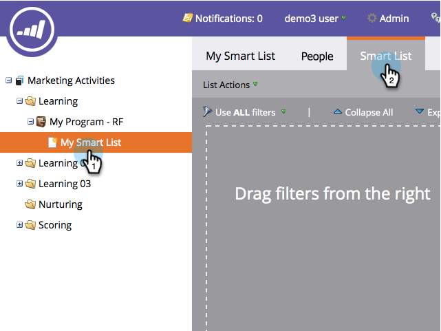

# Buscar personas duplicadas con lógica personalizada {#find-duplicate-people-with-custom-logic}

Marketo Engage tiene una lista inteligente del sistema que busca personas duplicadas haciendo coincidir sus direcciones de correo electrónico. Si desea utilizar otro campo para buscar duplicados con, siga los pasos a continuación.

>[!PREREQUISITES]
>
>[Crear una lista inteligente](/help/marketo/product-docs/core-marketo-concepts/smart-lists-and-static-lists/creating-a-smart-list/create-a-smart-list.md){target="_blank"}

1. Vaya al área **[!UICONTROL Actividades de marketing]**.

1. Seleccione su lista inteligente y haga clic en la ficha **[!UICONTROL Lista inteligente]**.

   

1. Busque y arrastre el filtro **[!UICONTROL Campos duplicados]** al lienzo.

   

1. Elija una de las cuatro opciones disponibles:

   * [!UICONTROL Dirección de correo electrónico]
   * [!UICONTROL Nombre completo]
   * [!UICONTROL Apellidos]
   * [!UICONTROL Actualizado A Las]

   >[!NOTE]
   >
   >Todos los campos, excepto la dirección de correo electrónico, distinguen entre mayúsculas y minúsculas. Por lo tanto, si utiliza &quot;John Doe&quot; en el campo Nombre completo, _no_ devolverá resultados para John Doe.

   

   Ejecute la lista inteligente para buscar personas con el mismo valor en el campo seleccionado anteriormente.
