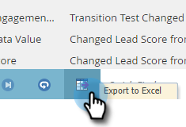

# Localizar el registro de actividad de una persona {#locate-the-activity-log-for-a-person}

El registro de actividad es la fuente fiable definitiva. Esta es la historia completa del recorrido de una persona en Marketo Engage.

1. Ir a **[!UICONTROL Base de datos]**.

   

1. Seleccione **[!UICONTROL Todas las personas]**.

   

1. Haga clic en la ficha **[!UICONTROL Personas]**. Seleccione un número de persona **[!UICONTROL Id]**.

   

1. Haga clic en **[!UICONTROL Registro de actividades]**.

   

   Ahora tiene una colección de toda la información que se produce a lo largo del tiempo para una persona.

   

## Exportar registro de actividades {#export-activity-log}

¿Necesita exportar el registro de actividad de una persona a Excel?

1. Después de seguir los pasos anteriores, desplácese hasta la parte inferior de la página y seleccione el icono Exportar.

   

1. Un archivo de Excel se descarga en el explorador.

   

   >[!MORELIKETHIS]
   >
   >Más información sobre [filtrar el registro de actividad](/help/marketo/product-docs/core-marketo-concepts/smart-lists-and-static-lists/managing-people-in-smart-lists/filter-activity-types-in-the-activity-log-of-a-person.md){target="_blank"} para ver actividades específicas de personas.
