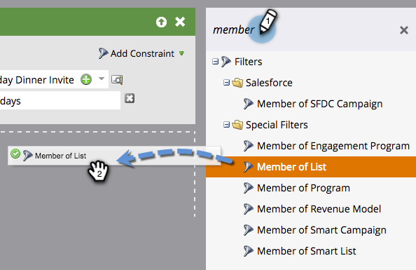

# Usar miembros de la lista en una lista inteligente {#use-members-of-list-in-a-smart-list}

>[!TIP]
>
>Puede agregar personas a una lista utilizando [Importar](/help/marketo/getting-started/quick-wins/import-a-list-of-people.md) o [Paso de flujo Añadir a lista](/help/marketo/product-docs/core-marketo-concepts/smart-campaigns/flow-actions/add-to-list.md).

Con este filtro, puede extraer miembros de otra lista haciendo referencia a él en las reglas de la lista inteligente. Así es como.

1. Seleccione una lista inteligente y haga clic en el botón **Lista inteligente** pestaña .

   

1. En el panel de filtros del lado derecho, busque y arrastre el **Miembro de la lista** filtre al lienzo.

   

1. Haga clic en la lista desplegable o escriba para buscar la lista que desee incluir en la lista inteligente.

   

   Listo! En este ejemplo, la lista inteligente ahora se dirigirá solo a los miembros de esa lista y los evaluará en función de cualquier otra regla que incluya.
