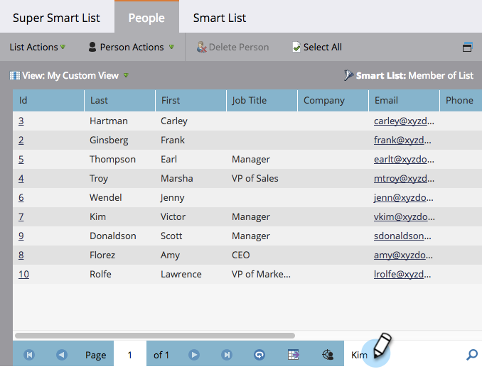

# Uso de la búsqueda rápida en una lista o lista inteligente {#use-quick-find-in-a-list-or-smart-list}

Busque una persona a partir de los resultados de una lista o lista inteligente mediante la búsqueda rápida.

1. Vaya a **[!UICONTROL Actividades de marketing]**.

   

1. Seleccione la lista inteligente que quiera buscar y luego haga clic en la ficha **[!UICONTROL Personas]**.

   

## Buscar Personas Mediante Información Personal {#find-people-using-personal-info}

1. En el cuadro **[!UICONTROL Búsqueda rápida]** de la parte inferior de la pantalla, escriba una palabra clave (**nombre personal**, **dirección de correo electrónico** o **cargo**).

   

1. Pulse Intro o haga clic en el icono de búsqueda y habrá terminado.

## Buscar personas con un nombre de empresa {#find-people-using-a-company-name}

1. Para buscar una compañía, escriba `[company]` en el cuadro Búsqueda rápida, seguido de cualquier parte del nombre de compañía que esté buscando.

   

1. Pulse Intro o haga clic en el icono de búsqueda y habrá terminado.
