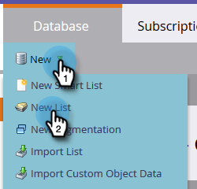
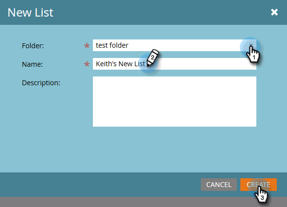

# Creación de una lista estática {#create-a-static-list}

Las listas estáticas son un grupo de personas que ya se encuentran en la base de datos.

1. Ir a **[!UICONTROL Base de datos]**.

   

1. Haga clic en el menú desplegable **[!UICONTROL Nuevo]** y seleccione **[!UICONTROL Nueva lista]**.

   

1. Elija una carpeta de destino, asigne un nombre a la nueva lista y haga clic en **[!UICONTROL Crear]**.

   

   Ahora tiene una lista vacía lista para rellenar. Aprenda a agregar personas [aquí](/help/marketo/product-docs/core-marketo-concepts/smart-lists-and-static-lists/static-lists/understanding-static-lists.md#ways-to-add-remove-people-from-a-list){target="_blank"}.

   >[!NOTE]
   >
   >Puede agregar a una persona a la lista tantas veces como desee, pero solo aparecerán una vez. Las personas permanecen en la lista hasta que las elimina.
